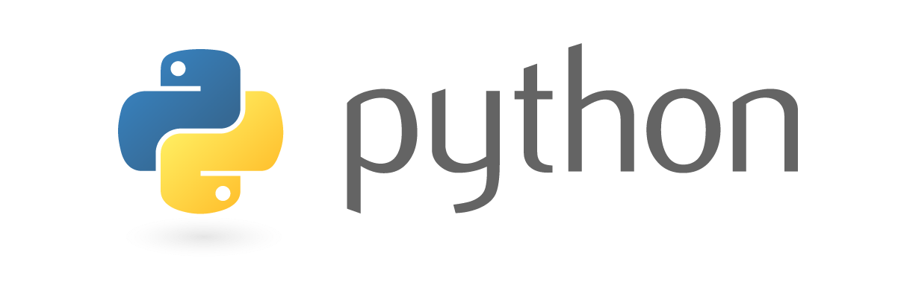

##Naver Data Science Competition 2018

2018.06.04 ~ 2018.09.20
=============================
## Team : BigMing (Big data mining of Geeks)

### ■ Team Member
- [임슬기 seul ki spes lim](https://github.com/bloomspes)
- [윤영 Yun Young](https://github.com/yunyoung1819)
- [김민수 Kim min su](https://github.com/alstn2468)

### ■ Team Slogan
 - for Better Code than yesterday!

### ■ Language

- Python

- Java

- Go

### ■ IDE

- PyCharm

<<<<<<< HEAD
### ■ IDE
=======

>>>>>>> 345565be66b36d213a417ca95163d5ef6aa97bea

- IntelliJ

<<<<<<< HEAD
=======

### ■ Team Character

>>>>>>> 345565be66b36d213a417ca95163d5ef6aa97bea
